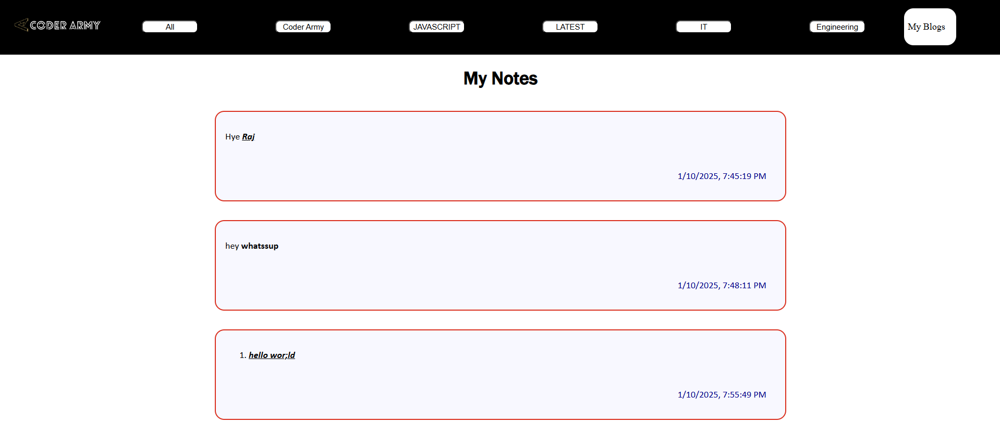

      PROJECT NAME - Dynamic Blog Website

First Of All Thanks To the Rohit Negi Sir, For This Wonderful Hackathon and Teaching, This hackathon helped me alot in my problem solving skills.

1)  INTRODUCTION OF MY PROJECT 

IN My This dynamic Blog Website platform where users can personalize their blogging experience by selecting up to five preferred categories from ten available options. This website enables users to filter and explore blogs matching their selected interests, take notes using a rich text editor, and even publish their own blogs. The platform provides an intuitive and user-friendly interface for both readers and content creators.
and the user can see all of their notes that he wrote with the time and date. 

2)  CORE FEATURES

Category Selection:
Users can select up to 5 blog categories from a list of 10 options, tailoring the content to match their interests.

Personalized Blog Feed:
Displays blogs based on the user’s chosen interests, allowing for a customized reading experience.

Blog Posting:
Users can create and publish their own blogs. Newly posted blogs are displayed at the top of the homepage.

Rich Text Editor:
A built-in editor enables users to take notes while reading blogs, making the site a useful tool for study or brainstorming.

Notes Page:
A dedicated section for users to view and manage their saved notes, ensuring easy access at any time.

All Blogs View:
A separate section allows users to view all the blogs they have posted in one place.

Responsive Design:
Optimized for devices of all sizes, providing a seamless user experience on desktops, tablets, and smartphones.

User-Friendly Interface:
Easy navigation with clear headers and buttons, ensuring a smooth and enjoyable interaction with the platform.

3) HOW TO USE 

Step 1: Choose Your Interests

Visit the homepage of the website.
Select up to 5 categories from a list of 10 options that match your preferences.
Click the Submit button to save your interests.
Your personalized blog feed will be generated based on these selections.

Step 2: Explore Blogs

Navigate through the Homepage to explore blogs tailored to your selected interests.
Use the filter options at the top to narrow down blogs within your selected categories.
At the bottom of the page, two fixed buttons are available:
Take Notes: Opens the rich text editor where you can jot down your thoughts.
Make Blogs: Takes you to the blog submission page.

Step 3: Take Notes

Use the built-in Rich Text Editor to write notes.
Save your notes, which will include a timestamp for easy tracking.
View all saved notes on the Notes Page, accessible from the header menu.

Step 4: Create Your Blog

Click the Make Blogs button (fixed at the bottom of every page).
Fill in the blog details:
Title
Content
Category
Upload an image
Submit your blog to publish it.
Your blog will appear at the top of the homepage and in the "My Blogs" section.

Step 5: Manage Notes and Blogs

View all your saved notes on the Notes Page, organized by date.
Visit the My Blogs Page to see all the blogs you have published.

Screenshots

starting page where user can select any 5 categories of blogs

As per The Choice of Blogs That User selected the blogs will be displayed at bottom there is two options to take notes and make blogs

The Rich Text Editor Will Be displayed in that page

After submitting the notes it will be displayed in the notes section

User Can Upload His blog Here.

All Blogs That Are Uploaded can be seen in this My Blogs Page

4) Technologies : HTML , CSS, JS

5) FUTURE ENHANCEMENTS :

Note Sharing
- Enable sharing of notes directly via email or social media platforms for enhanced productivity.

Category Expansion
Allow users to create custom categories or select from a wider variety of categories.

Blog Commenting and Rating
Allow users to comment on or rate blogs, adding an interactive and engaging element to the platform.

